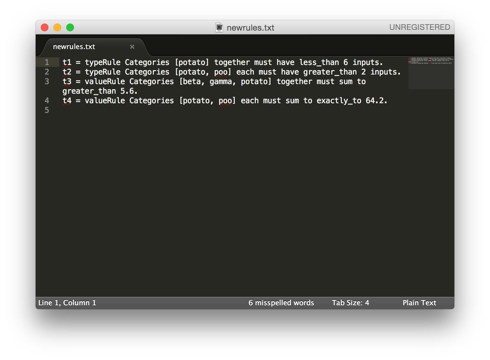
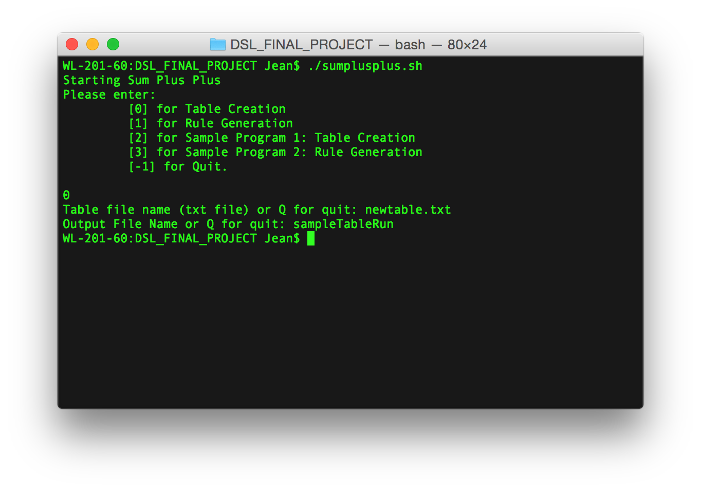
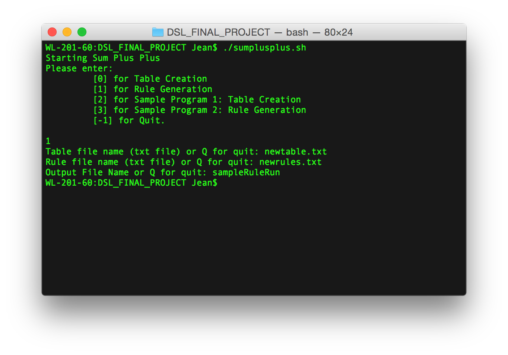

## sum plus plus


A weighted sum with custom constraints tool created by [Jean Sung](http://cs.hmc.edu/~jsung) for the [Final Project](http://www.cs.hmc.edu/~benw/teaching/cs111_fa14/project.html) in *Domain Specific Languages*, Fall 2014. The project's updates and how to install/run instructions can be found here. Keep up with the progress by visiting the [project notebook](https://github.com/jeansung/project-notebook). 

Sum Plus Plus is a tool to help you organize your thoughts regarding possible combinations of weighted types to satisfy custom constraints. 

Quick find help:
* [Instructions](https://github.com/jeansung/SumPlusPlus#instructions--help)  
* [Installing](https://github.com/jeansung/SumPlusPlus#installing)
* [Sample Programs](https://github.com/jeansung/SumPlusPlus#sample-programs)
* [Creating your own files](https://github.com/jeansung/SumPlusPlus#creating-your-own-files)
* [Running the test files](https://github.com/jeansung/SumPlusPlus#running-test-files)
* [Issues and feedback](https://github.com/jeansung/SumPlusPlus#issues--feedback)

## Instructions & Help 

### Installing
**Note:** At this time, there is only *tested* support for Mac OSX 10.8+. 

**Before you install** Your machine must have  
* `pip`
* python v 2.7.x
* a program that can open xls files (e.g. Excel, Numbers, etc)

Find help for installing [pip](https://pypi.python.org/pypi/pip) and [python 2.7.x](https://www.python.org/ftp/python/2.7.8/python-2.7.8-macosx10.6.dmg).

1. Download the Github Repo as a zip file. 

2. Extract the Zip file on the desktop. Open a `terminal` window and `cd` into the Desktop directory. Run the command `sudo ./bootstrap.sh` to install the python packages. You might be prompted for the user password, if so, enter it. 


### Sample Programs
To run the sample programs, run `python run.py`. Type `2` or `3` to run the sample programs. The Excel file should open after the program runs. 

Here is a sample run of the program with `table` and `rules` included. 

. 

Once the Excel file is open you can manipulate the inputs until the "bads" turn to "good". The blue box shows the area where you can manipulate. 


### Creating your own files 

**General I/O Notes**  
Input files, the `table` files and the `rule` files must live in the `input_files` directory. Output files, the created Excel sandbox files, are generated in the`output_files`. You must be in the top level directory when you run `run.py`, which is the file that runs the program.

**Creating the table and rules:**  
A table is a set of types and values. List the types in a comma separated string on the first line of the table file. List the values (can be int values or float values) as a comma separated string on the second line of the table file.

Here is a sample of the table file: 


A set of rules is a collection of newline separated rule strings. There are two types of rules, value rules and type rules. Value rules constrain the the weighted sum of one or more individual categories or a collection of categories together. Type rules constrain the number of inputs of one or more categories or a collection of categories together. 

Here is the grammar that the rules must adhere to. 
```
// primitive things 
letter = "A" | "B" | "C" | "D" | "E" | "F" | "G"
       | "H" | "I" | "J" | "K" | "L" | "M" | "N"
       | "O" | "P" | "Q" | "R" | "S" | "T" | "U"
       | "V" | "W" | "X" | "Y" | "Z" ;
digit = "0" | "1" | "2" | "3" | "4" | "5" | "6" | "7" | "8" | "9" ;
decimal_point = "." ;
decimal_value = { digit }, decimal_point, { digit } ;

// name is an identifier for a rule
name = { letter } ;

// Total inputs must be an int
// Total of the value may be a double
totalInputs = { digit } ;
totalValues = { decimal_value } ;

// A type is any word (i.e. made up of letters)
type = { letter }; 
types = { type }

// Other rule parts
operator = less_than | exactly_to | greater_than ;
relation = "each" | "together" ;

// Rule types 
typeRule =  Categories (types) (relation) must have (operator) \
		    (totalInputs) inputs. ;
valueRule = Categories (types) (relation) must sum to (operator) \
			(totalValues). ;
genericRule = typeRule | valueRule ;
Rule = name,  "=", genericRule;
Rules = {Rule} ; 
```

Here is a sample of the rules file:


**Creating the Excel Sandbox file:**

To create an initial Excel Sandbox table you must have a table file in the `input_files` directory. Then, use the command `python run.py` and type `0` for the option. 


If you want an Excel file with custom constraints too, you must have a rule file in the `input_files` directory. Then, use the command `python run.py` and type `1` for the option. 


All output files get written into the `output_files` directory. 


### Running test files
In order to run the test files, `cd` into the `testing` directory. Use the command ` python -m unittest discover` in order to run the tests. 


## Issues & Feedback
If you find an unexpected error or have any general feedback, please [file an issue](https://help.github.com/articles/creating-an-issue/) on GitHub. 


