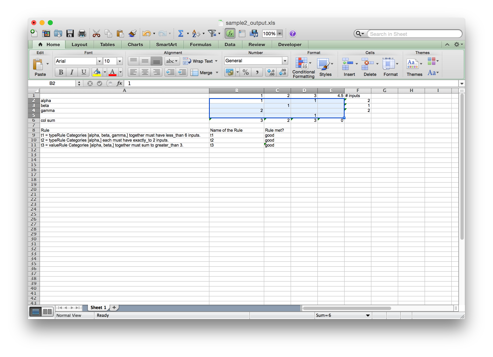

Final Project Write up  
Jean Sung  
December 12th, 2014  
Domain Specific Languages, Fall 2014  

## Introduction

Sum Plus Plus is a weighted sum with custom constraints tool to help visualize and manipulated data. The domain of my Domain Specific Language (DSL) is people who have a set of information in the form of types and values and rules for proper configurations of said information. I will give two examples of the types of people who might use my DSL to motivate the need for such a language.

**Gymnastics Coaches**  
*Use Case*: Create a gymnast's [routine](https://www.youtube.com/watch?v=qf0LRUpK2dE). A gymnast's routine is composed of various moves. Each of those moves have variations in terms of how difficult the move is, i.e. each move has several associated point values based on the difficulty. For example, a move might be a turn. The turn can have different difficulties based on whether the it is a half turn, a full turn, a 1.5 turn or a 2x turn.  Routines also have constraints about the number/types of moves and the ways in which they combine.
   
*How it is:* Right now, how routines are created is through a knowledgable coach and a manual, the code of points. The code of points has all legal moves for a gymnast, and all of the variations of a given move as well as their point values. There are written rules about the way in which it is legal to combine moves to form a routine. However, in the actual creation of the routine, the coach and the gymnast work together to choose from types and moves to build a routine together. It is a time intensive and mentally laborious process because the coach must be intimately knowledgable about the manual code of points and the gymnast's abilities to craft the perfect routine.

*How it should be/ where my DSL comes in:* My DSL would provide a more automated and extensible addition to the routine creation process. This is because you could encode the moves and the variations (values) as the table. Adding in the rules, you now have a sandbox where you can try different combination of moves and see if given all of the legal routine constraints and the gymnast's ability constraints, you can create a perfect routine. The sandbox means you can try different configurations really easily. And if you had to try again, there is relatively low overhead for that. In addition, my tool allows the coaches and gymnasts to create contingency plans. A lot of times, routines encompass one or two risky moves that a gymnast spends a lot of time practicing, but if they miss during a competition, this tool allows the gymnast to keep a few easy to remember and viable alternatives in mind. 


**Teachers in the Classroom**  
*Use Case*: Creating an test or quiz for the class. A model for creating exams is to have a lot of generated problems or questions and pull from an existing list or pool of those questions to form a given quiz or exam. 
   
*How it is:* One way that exams can be created is as mentioned before, to pull the problems from a bank or pool of them. A teacher may have problems in different sub topics for an exam of a given topic. Within each sub topic question, there are harder and easier questions to give. A teacher may have internally expressed considerations for the constraints of combining questions. For example, they may want to pull multiple questions from a given sub set of topics. They may want two questions to sum to more than a certain difficulty level so that the test has questions relating to a subtopic that may have been covered a lot in class or is really important. This tool will also allow the teacher to create exams of a relative quantitive difficulty, especially in relation to other tests created with this tool. This would allow teachers to scale test difficulty based on students performance. 

*How it should be/where my DSL comes in:* My DSL would provide a more automated way for test creation. The teacher could enter in the problem bank (with relevant sub types and difficulty levels) and then enter a set of constraints per test and use that as a Sandbox. This way the teacher can try out different configurations and combination of test questions to create a good test. Moreover, you can write different set of constraints for the same problem bank if the requirement changes for another test.

From these two possible use cases, it can be seen that the essence of Sum Plus Plus is that it is a way to create a sandbox for a set of data with some user generated constraints so that the user can try out different configurations. This is a good language for the domain because it is designed with the user in mind, they enter rules in text in near English syntax, and the output is in Excel so there is a sandbox environment where you can manipulate input and it will live update with how the rules are. 

## Language Design Details

The dream for what a user can do to create a table and a rule file is through a web interface where there would be minimal typing. The table would be probably create by typing a new line separated list. The values you could choose. Then with a given table, you would be able to generate a rule by choosing the options at each of the place where the word varies, and there would be a drop down menu. This would remove entirely the possibility of syntax error when it comes to the user entering the rules. Then, the user can press the download now button which will generate the Excel sandbox file for download. 

Right now,A user writes programs in my language by creating a table file and a rule file. The table file is a two line file, with the first line of types, and the second line of values. Both lines should be comma separated and white space is okay. The rule file must contain a set of rules that follow this grammar:

```
// primitive things 
letter = "A" | "B" | "C" | "D" | "E" | "F" | "G"
       | "H" | "I" | "J" | "K" | "L" | "M" | "N"
       | "O" | "P" | "Q" | "R" | "S" | "T" | "U"
       | "V" | "W" | "X" | "Y" | "Z" ;
digit = "0" | "1" | "2" | "3" | "4" | "5" | "6" | "7" | "8" | "9" ;
decimal_point = "." ;
decimal_value = { digit }, decimal_point, { digit } ;

// name is an identifier for a rule
name = { letter } ;

// Total inputs must be an int
// Total of the value may be a double
totalInputs = { digit } ;
totalValues = { decimal_value } ;

// A type is any word (i.e. made up of letters)
type = { letter }; 
types = { type }

// Other rule parts
operator = less_than | exactly_to | greater_than ;
relation = "each" | "together" ;

// Rule types 
typeRule =  Categories (types) (relation) must have (operator) \
		    (totalInputs) inputs. ;
valueRule = Categories (types) (relation) must sum to (operator) \
			(totalValues). ;
genericRule = typeRule | valueRule ;
Rule = name,  "=", genericRule;
Rules = {Rule} ; 

```

There are two types of rules, value rules and type rules. A value rule is a constraint on the weighted sum of one or more categories. A type rule is a constraint on the number of types across a given categories. Syntactically, the rule language grammar is designed to be just about English so that the process of creating rules easy as possible for the non technical user. The way the grammar of the rule is structured also prevents the user from saying much else besides the type and value rules. Thus, the language is easier than the syntax of a general purpose language because it is purposefully restrictive to this domain. 


Right now, my language does not have a computation model as it is. The primary goal of my language is to translate English rules to Excel formula so there is more of a mapping rather than a computation. However, the computational model that is planned for this language in the future is consistency checking. This means that the basic computation that my language performs is a check to see if the set of rules for a specific table led to a contradiction or an impossibility (where any input in the table would err). The basic data structures in my language is a tuple of (table, rules). The table is probably some sort of 2D array, and the rules are a list of rule objects (post parsing, a list of keywords). There really is not any control structure or control flow in the language. This is because the user is manipulating data to see whether the output is consistent. There not a sense of a "program flow" so to speak when using my language.

My DSL requires 2 files for input, a file that specifies the table and a file that specifies the rules. There is a 1 file output, which is an Excel file. The dream vision for my project has no text input or output, but instead, just having the user do everything in a GUI, saving possibly a preferred configuration as a text file. The most common way a program can go wrong is that a user will reference a type in the rule file that is not yet defined in the table file. There is a special and specific error handling for this case and it will alert the user of the type that causes the error. Another type of error that can go wrong is to have incorrect syntax for the rules. This could happen now because the interface is just plain text as opposed to having the use choose from predefined options. When this happens, I will print out a reminder for what the syntax should look like. 

My tool will support error checking as above noted, and there will be a sandbox environment to play with the table / custom constraints. With the most ideal version of this project, I envision that the support will be further extended with a full GUI and a validation checker for the rules 

There are not really any other languages that I know of or have come across during my time with this project. It should be noted that technically, all of the engineering work is supported by raw Excel but I don't know of another piece of software or language at abstracts the constraints to be this easy or nice to work with. 


## Example Programs

There are two provided example programs in the repository. One of the example programs is to show how table creation works, and the output file is labeled `sample1_output.xls` and it pulls the types and values from `sample_table.txt`. The other file is labeled `sample2_output.xls` and it pulls the table from the same file as previously, `sample_table.txt` and it pulls the rules to parse from the file labelled `sample_rules.txt`. How these files work is the program will start by asking the user which option they would like to choose. There are two sample program options, which can be accessed by pressing `2` or `3`. Otherwise, you can generate the initial table by selecting option `0` or generate a table with the custom constraints by selecting option `1`.  

Here is the sample sandbox file that is the result of the run of the program:




## Language Implementation 

The host language I used to implement my DSL in is Python. This is because Python has particularly good Package support, especially for interfacing with Excel, writing unit tests and interfacing with virtual environments. This made it very easy to gather what I needed. Also, I am more familiar with Python so the overhead of learning the language was minimized. 

My language for the rule creation is definitely and external DSL. This is the right design because it maximizes the readability of the rules. It is deliberately chosen as such because this is the closest to how the constraints would actually be described. The implementation of the sandbox file in Excel can be through of as an internal DSL for Excel. This is because it leverages a subset of Excel's functionality. This is the correct design because Excel already has the ability to sum across rows and columns and the if logic is already there so in combination with the live updating (based on certain inputs) would be silly for me to reimplement. The smart choice is to leverage the functionality of Excel. In addition, using Excel or Numbers or some other program is a good choice because I am aiming at non technical users. These people probably are more familiar with the Excel like interface so there is less overhead in learning a new tool. It will also be less intimidating if it is in Excel. 

Here is an overview of the architecture of the language with notes on where parsing, IR, and semantics is. 



## Evaluation

### DSL-y
My language is very DSL-y so to speak. This is because it is designed in a way that makes it easy to specify an environment for a weighted sum with custom constraints but it is pretty much impossible to do anything else. The rule parser is written with extensibility's of the specific use cases in mind, and not at all for general functionality extensibility. I also did not design the architecture with an extensible use case in mind, in terms of the domain. 


### What I like
I like that you can use this product from end to end. I added instructions and error handling which make sit even easier for a non technical audience to use which is nice. I like that the entire thing came up to be a final product, a deliverable that can be downloaded. 


### What to improve 
I could have more test cases for the parser. A better front end would be nice. Right now everything has to be done from the terminal is not the ideal UI. The text file has to also be formatted exactly so. A web interface would be more ideal (but I am not planning to do this because of time constraints). Also implementing the validation checker for the rules would be a good idea in terms of letter an end user manage more rules more feasibly. 


### Bigger picture evaluation
I said I planned to use user tests and self test with my original use cases to see if I could accomplish what I set out as a goal in the `description.md` file. I have not done formal user tests but so far I have had my friends informally try out the tool, which is how I mainly evaluate the design. I will do the self tests with my two original use cases at the end when I am done with the functionality of the program. I also ask about/ receive feedback on the design on a weekly basis from Alejandro. Also the user test from Sarah was helpful. The feedback from these sessions showed me sample programs, instructions are key to making it easy to use for new users. Also, the type/values (i.e. the table file) is probably best inputted as one file (simpler is easier to manage). In addition, the critiques from Alejandro were very helpful because he was able to suggest tools that made the engineering part of the project easier. The main change that I made to program as a result of these critiques is two fold: creating the sandbox environment with the tables, creating the rules separate from the table (still dependent on the table but now in a separate run). 



## Reflection
I ran into the trouble with coding as my evolved (i.e. not knowing the architecture upfront) and coding in a way to make things to work first. This meant a bit of messy code and cross connected files with increasingly unwieldy dependencies. Thus, I had to spend time refactoring the code, and re deciding how the architecture informs the code. I also had some trouble with the feature of including a constraint consistency checker (i.e. looking for a contradiction within the rules). The solution is linear programming, which I now know is something that can be done in MatLab. I did find a feasible way to do it in Python but decided it was out of the scope of the project for this semester. 

I have been working by myself. Some weeks I had trouble finding the time during the week to start the project. I ended up having to do 4+ hour blocks on Saturday/ Sunday to meet the quota of 9 hours/  week. I started meeting with Prof Ben during the week and this helps force me to think about what is upcoming for my project in a critical way earlier in the week. I also worked a fair bit over Thanksgiving break, which definitely helped. Some weeks I also put more than 9 hours which worked well too.
